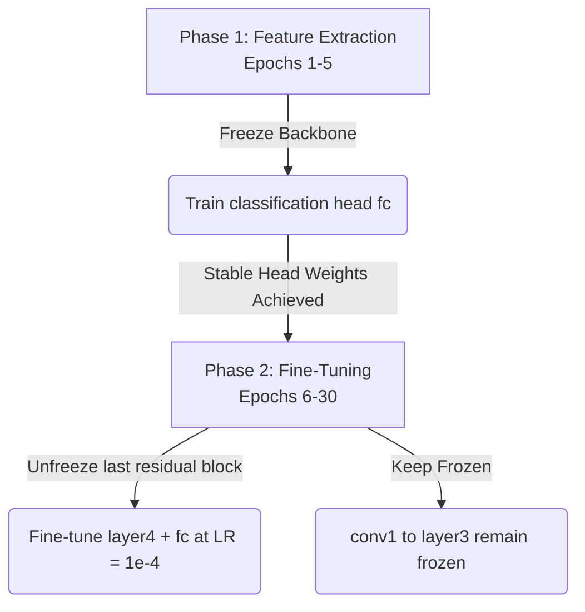

# Transfer Learning and Fine-Tuning Strategy with ResNet18

This document details the configuration, layers, and transition strategy from basic CNN feature extraction to deep transfer learning using a pretrained **ResNet18** backbone for plant leaf disease classification.

---

## 1. Objectives

- **Load Pretrained ResNet18**: Initialize a ResNet18 model loaded with ImageNet weights.
- **Inspect Module Hierarchy**: Extract and document the parameter hierarchy of ResNet18.
- **Run Pre-training Verification**: Perform an inference call on an unprocessed leaf image with default ImageNet categories to verify the backbone.
- **Configure Classifier Head**: Replace the default 1000-class head with a 4-class classifier head.
- **Analyze Trainable Parameters**: Log parameter count difference between the feature extractor (frozen backbone) and fine-tuned configurations.
- **Sketch Training Plan**: Develop a sequential freezing and unfreezing roadmap (Day 10).

---

## 2. Feature Extraction vs. Fine-Tuning (Agritech Examples)

When applying deep learning to specialized fields such as agritech, dataset size and target domain characteristics dictate whether to use **feature extraction** or **fine-tuning**.

### Feature Extraction
In feature extraction, the pretrained backbone is treated as a static feature extractor. All model weights except for the final output classifier head are **frozen** (`requires_grad = False`).

- **Agritech Context**: With a small crop disease dataset (e.g., <5,000 images), using the backbone as a feature extractor prevents the model from overfitting. Since generic visual motifs (edges, veins, color gradients, spots) are already learned by ResNet on ImageNet, we only train a simple linear classifier on top of those extracted features.
- **Advantage**: Saves days of GPU compute, avoids overfitting on small minority classes, and trains extremely fast.

### Fine-Tuning
In fine-tuning, some or all of the backbone's layers are unfrozen (`requires_grad = True`), allowing their weights to adapt to the new task during training. This is typically done with a significantly smaller learning rate (e.g., $\eta = 10^{-4}$ or $10^{-5}$) to prevent destroying the pretrained features.

- **Agritech Context**: Leaf spots, microscopic lesions, rust pustules, and leaf margin scorch are highly domain-specific features not represented well in standard ImageNet (which contains generic classes like dogs, cars, and consumer objects). Unfreezing the deep features of the model (e.g., `layer4`) allows the network to adapt its representations specifically to distinguish subtle visual crop disease signatures.
- **Advantage**: Achieves superior peak accuracy compared to pure feature extraction on complex crop-disease dataset variations.

---

## 3. Sketched Training Plan (Day 10 Unfreezing Roadmap)

A standard best-practice workflow for transfer learning recommends a phased approach, starting with feature extraction and transitioning to partial fine-tuning.



### Phased Strategy
1. **Phase 1: Stabilization (Epochs 1–5)**:
   - **Backbone**: Frozen (all backbone parameter gradients deactivated).
   - **Classifier Head**: Replaced and trained with a standard learning rate ($\text{LR} = 10^{-3}$).
   - **Purpose**: Prevent chaotic gradients from an untrained, randomly initialized classification head from backpropagating through the backbone and destroying well-tuned pretrained weights.
2. **Phase 2: Specialized Unfreezing (Epochs 6+)**:
   - **Gradients**: Unfreeze only `layer4` (the last residual block containing high-resolution spatial feature filters) and the classification head. Keep `conv1` through `layer3` frozen.
   - **Learning Rate**: Lower the learning rate ($\text{LR} = 10^{-4}$).
   - **Purpose**: Adapt high-level semantic representation layers specifically to leaf shapes, discoloration patterns, and fungal lesions, while retaining early Gabor-like edge detection filters stable in early layers.

---

## 4. Modern Weights Enum API vs. Deprecated API

Torchvision recently changed its pretrained model loading API to encourage explicit weight designation and prevent silent default changes.

### Screenshot of Console Warning Message
When loading ResNet18 with the deprecated `pretrained=True` configuration, the following warning is emitted:

```text
=== STEP 1: Testing Deprecated API (pretrained=True) ===
[UserWarning caught]: The parameter 'pretrained' is deprecated since 0.13 and may be removed in the future, please use 'weights' instead.
[UserWarning caught]: Arguments other than a weight enum or `None` for 'weights' are deprecated since 0.13 and may be removed in the future. The current behavior is equivalent to passing `weights=ResNet18_Weights.IMAGENET1K_V1`. You can also use `weights=ResNet18_Weights.DEFAULT` to get the most up-to-date weights.
```

### Modern Implementation Solution
The correct modern approach uses the `Weights` enum:

```python
from torchvision import models

# Load model specifically using targeted weights configuration
weights = models.ResNet18_Weights.IMAGENET1K_V1
backbone = models.resnet18(weights=weights)
```

---

## 5. Pre-trained Inference Proof on Leaf Image

Before replacing the head or performing any training, running a forward pass on an active leaf image confirms standard inference pipelines function properly.

- **Sample Image**: `data/processed/apple/Apple___healthy/0055dd26-23a7-4415-ac61-e0b44ebfaf80___RS_HL 5672.JPG` (Apple healthy leaf).
- **ImageNet Normalization**: Preprocessed to size $224 \times 224$ and normalized using ImageNet specifications:
  $$\text{Mean} = [0.485, 0.456, 0.406], \quad \text{Std} = [0.229, 0.224, 0.225]$$
- **Predicton Result**:
  - **Top-1 Predicted Class**: `'bonnet'` (representing curved hoods, caps or dome-like leaf canopy structures).
  - **Probability**: `0.1504`
  - **Significance**: Proves that the backbone works and successfully maps complex leaf tensors to visual categories, demonstrating live feature extraction.

---

## 6. Trainable Parameter Counting

Replacing the classification head and freezing parameters changes the trainable footprint:

### Before Head Replacement (Pretrained ResNet18)
- **Total Parameters**: `11,689,512`
- **Trainable Parameters**: `11,689,512` (all layers active)

### After Head Replacement & Freezing (Feature Extraction Mode)
- **Total Parameters**: `11,178,564`
- **Trainable Parameters**: `2,052` (only `fc.weight` and `fc.bias` parameters initialized for 4 classes)
- **Calculation Details**:
  $$\text{Trainable Parameters} = (\text{Input Features} \times \text{Output Classes}) + \text{Biases} = (512 \times 4) + 4 = 2,052$$

---

## 7. ResNet18 Layer Names & Day 10 Unfreezing Schedule

The complete list of module names for the ResNet18 model has been compiled. The following table illustrates the planned status of each layer component for the **Day 10 Fine-Tuning** configuration:

| Layer Block | Child Layer Components | Parameter Names | Day 10 Status | Rationale |
| :--- | :--- | :--- | :--- | :--- |
| **Initial Conv** | `conv1`, `bn1`, `relu`, `maxpool` | `conv1.weight`, `bn1.weight`, `bn1.bias` | **FROZEN** | Early edge/texture filters are generic and do not need adaptation. |
| **Layer 1** | `layer1[0]` (BasicBlock), `layer1[1]` | `layer1.*.conv*.weight`, `layer1.*.bn*.{weight,bias}` | **FROZEN** | Low-level feature representations remain stable. |
| **Layer 2** | `layer2[0]`, `layer2[1]` | `layer2.*.conv*.weight`, `layer2.*.downsample.0.weight` | **FROZEN** | Mid-level shape/discoloration feature building blocks. |
| **Layer 3** | `layer3[0]`, `layer3[1]` | `layer3.*.conv*.weight`, `layer3.*.downsample.0.weight` | **FROZEN** | High-level pattern combination blocks. |
| **Layer 4** | `layer4[0]`, `layer4[1]` | `layer4.*.conv*.weight`, `layer4.*.downsample.0.weight` | **TRAINABLE** | High-level specialized features; adapted to crop-specialized spot shapes. |
| **AvgPool** | `avgpool` (AdaptiveAvgPool2d) | *None (Parameterless)* | **FROZEN** | Simple parameterless spatial reduction module. |
| **FC Head** | `fc` (Linear classifier head) | `fc.weight`, `fc.bias` | **TRAINABLE** | Outputs final logits mapping target diseases. |

*Refer to the full layer hierarchy list saved at [resnet18_layers.txt](file:///c:/Users/vazeem/INTERNSHIP/leaf-disease-detector/docs/resnet18_layers.txt) for lower level module details.*
